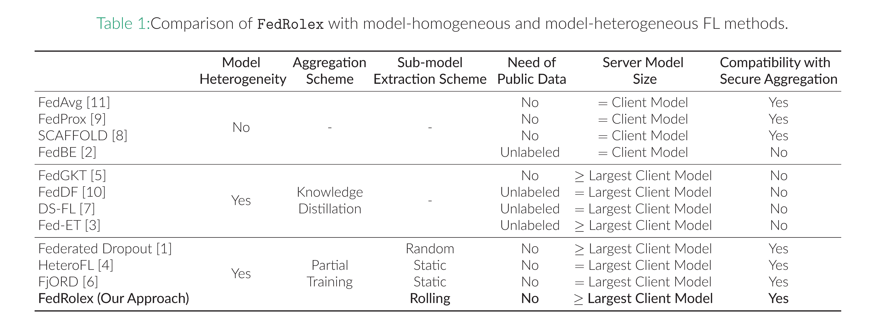
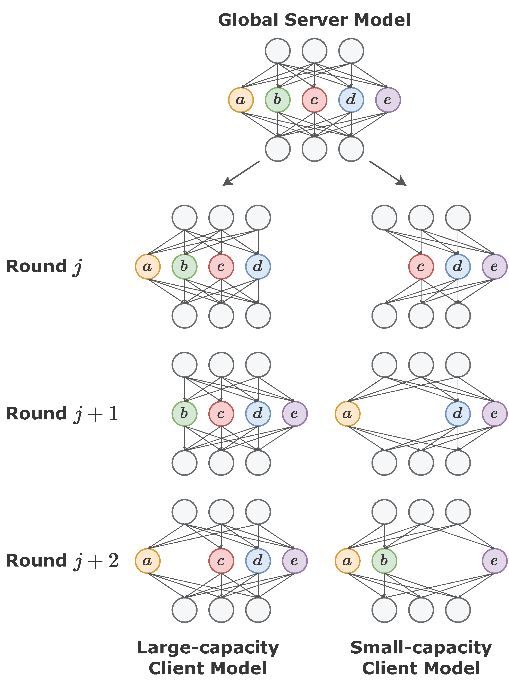
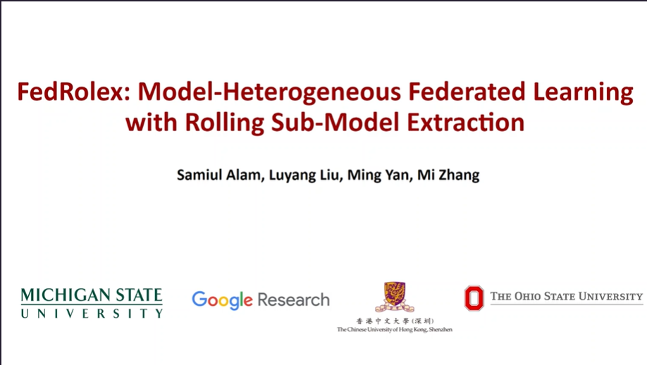

# FedRolex: Model-Heterogeneous Federated Learning with Rolling Sub-Model Extraction

Code for paper:
> [FedRolex: Model-Heterogeneous Federated Learning with Rolling Sub-Model Extraction](https://openreview.net/forum?id=OtxyysUdBE)\
> Samiul Alam, Luyang Liu, Ming Yan, and Mi Zhang.\
> _NeurIPS 2022_.

The repository is built upon [HeteroFL](https://github.com/dem123456789/HeteroFL-Computation-and-Communication-Efficient-Federated-Learning-for-Heterogeneous-Clients). 

# Overview

Most cross-device federated learning studies focus on the model-homogeneous setting where the global server model and local client models are identical. However, such constraint not only excludes low-end clients who would otherwise make unique contributions to model training but also restrains clients from training <b>large models</b> due to on-device resource bottlenecks. We propose `FedRolex`, a partial training-based approach that enables <b>model-heterogeneous FL </b>and can train a global server model larger than the largest client model. 

<p align="center">

</p>

The key difference between `FedRolex` and existing partial training-based methods is how the sub-models are extracted for each client over communication rounds in the federated training process. Specifically, instead of extracting sub-models in either random or static manner, `FedRolex` proposes a <b>rolling sub-model extraction scheme</b>, where the sub-model is extracted from the global server model using a rolling window that advances in each communication round. Since the window is rolling, sub-models from different parts of the global model are extracted in sequence in different rounds. As a result, all the parameters of the global server model are evenly trained over the local data of client devices.

<p align="center">

</p>

# Video Brief
Click the figure to watch this short video explaining our work.

[](https://recorder-v3.slideslive.com/#/share?share=74286&s=8264b1ae-a2a0-459d-aa99-88d7baf2d51f)

# Usage
## Setup
```commandline
pip install -r requirements.txt
```

## Training
Train RESNET-18 model on CIFAR-10 dataset.
```commandline
python main_resnet.py --data_name CIFAR10 \
                      --model_name resnet18 \ 
                      --control_name 1_100_0.1_non-iid-2_dynamic_a1-b1-c1-d1-e1_bn_1_1 \
                      --exp_name roll_test \
                      --algo roll \
                      --g_epoch 3200 \
                      --l_epoch 1 \
                      --lr 2e-4 \
                      --schedule 1200 \
                      --seed 31 \
                      --num_experiments 3 \
                      --devices 0 1 2
```
`data_name`: CIFAR10 or CIFAR100 \
`model_name`: resnet18 or vgg
`control_name`: 1_{num users}_{num participating users}_{iid or non-iid-{num classes}}_{dynamic or fix}
_{heterogeneity distribution}_{batch norm(bn), {group norm(gn)}}_{scalar 1 or 0}_{masked cross entropy, 1 or 0} \
`exp_name`: string value \
`algo`: roll, random or static \
`g_epoch`: num global epochs \
`l_epoch`: num local epochs \
`lr`: learning rate \
`schedule`: lr schedule, space seperated list of integers less than g_epoch \
`seed`: integer number \
`num_experiments`: integer number, will run `num_experiments` trials with `seed` incrementing each time \
`devices`: Index of GPUs to use \

To train Transformer model on StackOverflow dataset, use main_transformer.py instead.
```commandline
python main_transformer.py --data_name Stackoverflow \
                           --model_name transformer \
                           --control_name 1_100_0.1_iid_dynamic_a6-b10-c11-d18-e55_bn_1_1 \
                           --exp_name roll_so_test \
                           --algo roll \
                           --g_epoch 1500 \ 
                           --l_epoch 1 \
                           --lr 2e-4 \
                           --schedule 600 1000 \
                           --seed 31 \
                           --num_experiments 3 \
                           --devices 0 1 2 3 4 5 6 7
```
To train a data and model homogeneous the command would look like this.
```commandline
python main_resnet.py --data_name CIFAR10 \
                      --model_name resnet18 \
                      --control_name 1_100_0.1_iid_dynamic_a1_bn_1_1 \ 
                      --exp_name homogeneous_largest_low_heterogeneity \
                      --algo static \
                      --g_epoch 3200 \
                      --l_epoch 1 \
                      --lr 2e-4 \
                      --schedule 800 1200 \ 
                      --seed 31 \
                      --num_experiments 3 \
                      --devices 0 1 2
```
To reproduce the results of on Table 3 in the paper please run the following commands:

CIFAR-10
``` commandline
python main_resnet.py --data_name CIFAR10 \
                      --model_name resnet18 \
                      --control_name 1_100_0.1_iid_dynamic_a1-b1-c1-d1-e1_bn_1_1 \ 
                      --exp_name homogeneous_largest_low_heterogeneity \
                      --algo static \
                      --g_epoch 3200 \
                      --l_epoch 1 \
                      --lr 2e-4 \
                      --schedule 800 1200 \ 
                      --seed 31 \
                      --num_experiments 5 \
                      --devices 0 1 2
```
CIFAR-100
``` commandline
python main_resnet.py --data_name CIFAR100 \
                      --model_name resnet18 \
                      --control_name 1_100_0.1_iid_dynamic_a1-b1-c1-d1-e1_bn_1_1 \ 
                      --exp_name homogeneous_largest_low_heterogeneity \
                      --algo static \
                      --g_epoch 2500 \
                      --l_epoch 1 \
                      --lr 2e-4 \
                      --schedule 800 1200 \ 
                      --seed 31 \
                      --num_experiments 5 \
                      --devices 0 1 2
```
StackOverflow
```commandline
python main_transformer.py --data_name Stackoverflow \
                           --model_name transformer \
                           --control_name 1_100_0.1_iid_dynamic_a1-b1-c1-d1-e1_bn_1_1 \
                           --exp_name roll_so_test \
                           --algo roll \
                           --g_epoch 1500 \ 
                           --l_epoch 1 \
                           --lr 2e-4 \
                           --schedule 600 1000 \
                           --seed 31 \
                           --num_experiments 5 \
                           --devices 0 1 2 3 4 5 6 7
```

Note: To get the results based on the real world distribution as in Table 4, use `a6-b10-c11-d18-e55` as the 
distribution.

## Citation
If you find this useful for your work, please consider citing:

```
@InProceedings{alam2022fedrolex,
  title = {FedRolex: Model-Heterogeneous Federated Learning with Rolling Sub-Model Extraction},
  author = {Alam, Samiul and Liu, Luyang and Yan, Ming and Zhang, Mi},
  booktitle = {Conference on Neural Information Processing Systems (NeurIPS)},
  year = {2022}
}
```


